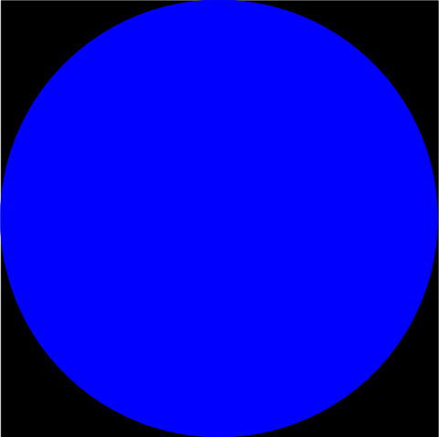
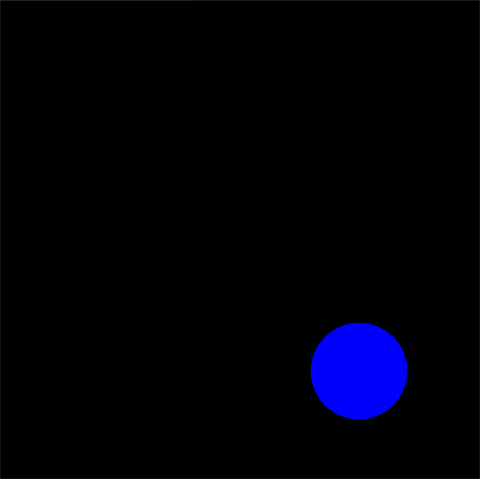
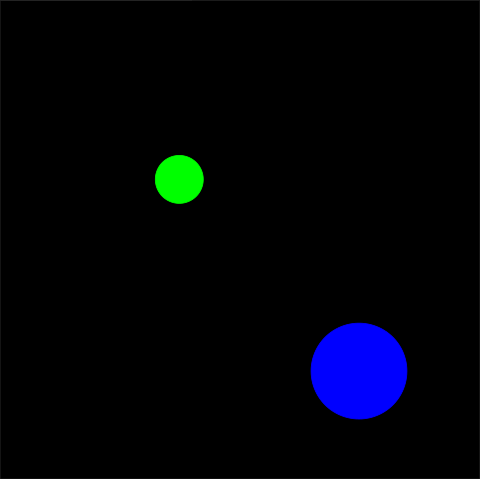
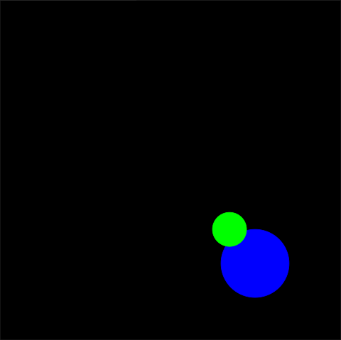

<!-- License

Copyright 2022 Neuromechatronics Lab, Carnegie Mellon University (a.whit)

Created by: a. whit. (nml@whit.contact)

This Source Code Form is subject to the terms of the Mozilla Public
License, v. 2.0. If a copy of the MPL was not distributed with this
file, You can obtain one at https://mozilla.org/MPL/2.0/.
-->

# ros_tkinter_spheres_environment_gui

A ROS2 package that provides a Tkinter-based 2D graphical interface for a 
virtual environment, in which spherical objects interact in a 3D space.

This package uses the [ros_spheres_environment] to add ROS2 capabilities to the 
[tkinter_spheres_environment_gui] Python package. 

## Installation

This package can be added to any [ROS2 workspace] (also see the explanation of 
[colcon workspaces] for additional information). See the [installation documentation](doc/markdown/installation.md) for further details.

### Testing

See the [testing documentation](doc/markdown/testing.md) for further 
information.

## Getting started

Perhaps the best way to get started is via a simple example. The code that 
follows must be run from within a [configured ROS2 environment]. Be sure to 
[source the workspace overlay], in addition to the 
[ROS2 environment][source the ROS2 environment]. This example uses the Python 
interface, but an equivalent command-line example is provided 
[elsewhere](doc/markdown/example-command_line.md) in the documentation.

For the sake of this example, it will be assumed that the objective is to 
create an environment where a spherical cursor can be moved around a 
two-dimensional plane to interact with a set of spherical targets. As noted 
in the [tkinter_spheres_environment_gui] documentation, however, the third 
(`z`) dimension of the spheres is ignored for the sake of visualization; that 
is, the spheres are represented as circles on the 2D canvas plane (see images 
below).

The first step is to initialize a ROS2 interface.

```python
>>> import rclpy
>>> rclpy.init()

```

Next, create a GUI environment node. This initializes a top-level GUI window, 
with a blank canvas, and connects the canvas to the [ROS2 graph].

```python
>>> from ros_tkinter_spheres_environment_gui import Node
>>> node = Node()

```

The ROS2 node wraps a GUI that implements the interface to a virtual 
environment defined in the [spheres_environment] package. The methods of this 
interface are mapped to GUI elements. Establish some shorthand to clarify the 
relevant objects and interfaces.

```python
>>> environment = node.environment
>>> canvas = environment.gui.canvas

```

Add a spherical target to the environment. Although the GUI will not change 
(without further action), 
it can be verified that the target object has been 
added to the environmental state. The parameters of the target are set to some 
default values. 

```python
>>> target = environment.initialize_object('target')
>>> environment['target']
{'position': {'x': 0.0, 'y': 0.0, 'z': 0.0}, 'radius': 1.0}

```

To make the sphere visible, change the target color to blue and update the 
canvas. The default color of both the sphere and the background is black. 
Sphere colors are specified via an [RGBA] color model, where values can 
range from `0.0` to `1.0`. Due to limitations of tkinter, the alpha parameter 
of the color model is thresholded: the object is completely transparent for any 
values less than `1.0`.

```python
>>> target.color = (0.0, 0.0, 1.0, 1.0)
>>> environment.update()

```

The canvas should now appear as shown in Figure 1. The target fills the center 
of the canvas, because the radius is set to `1.0` and it is positioned at the 
origin. The canvas GUI uses normalized coordinates that range from `-1` 
to `+1` in each dimension. The target radius is expressed in terms of these 
coordinates. Therefore, a unit radius will result in a diameter two circle that 
intersects with the edges of the workspace.



Set new parameters to re-size and re-position the target.

```python
>>> target.radius = 0.20
>>> target.position = (0.50, -0.55, 1.00)
>>> environment.update()

```

The canvas should now appear as in Figure 2. The target is smaller and is away 
from the origin. Note that the 3rd (`z`) coordinate of the target position is 
set arbitarily, and that this has no visible effect.



Add a cursor to the workspace, and similarly set parameters.

```python
>>> cursor = environment.initialize_object('cursor')
>>> cursor.color = (0.0, 1.0, 0.0, 1.0)
>>> cursor.radius = 0.10
>>> cursor.position = (-0.25, 0.25, 0.00)
>>> environment.update()
>>> list(environment)
['target', 'cursor']

```

The canvas should now appear as in Figure 3. Both a cursor and a target are 
visible on the canvas.



Move the cursor to intersect with the target. The canvas should now appear as 
in Figure 4.

```python
>>> cursor.position = (0.35, -0.35, 1.0)
>>> environment.update()

```



Note that the cursor appears in the foreground of the canvas, even thought the 
3rd (`z`) coordinate of the target position exceeds that of the cursor 
position. Note further that the `z` coordinates does not affect the appearance 
of the spheres in any way (e.g., size). This is because the canvas is 2D, and 
the third coordinate does not affect visualization. It is possible to change 
the [z-order] of the spheres by bringing the target to the foreground.

```python
>>> target.to_foreground()
>>> environment.update()

```

Finally, clean up by deleting the environment, destroying the node, and 
shutting down the ROS2 interface. This closes the GUI window. This step is not 
strictly necessary, as the GUI will otherwise be destroyed when the environment 
is implicitly deleted by the Python environment. However, it is good practice 
to shut down the ROS2 interface.

```python
>>> #environment.gui.destroy()
>>> del environment
>>> node.destroy_node()
>>> rclpy.shutdown()

```

### Example doctests

The examples in this README are rendered in [doctest] format, and can be run 
via the following code:[^python_paths]

[^python_paths]: Provided that the package is installed, or the [Python path] 
                 is otherwise set appropriately.

```
import doctest
doctest.testfile('README.md', module_relative=False)

```

## License

Copyright 2022 [Neuromechatronics Lab][neuromechatronics], 
Carnegie Mellon University

Created by: a. whit. (nml@whit.contact)

This Source Code Form is subject to the terms of the Mozilla Public
License, v. 2.0. If a copy of the MPL was not distributed with this
file, You can obtain one at https://mozilla.org/MPL/2.0/.

<!---------------------------------------------------------------------
   References
---------------------------------------------------------------------->

[Python path]: https://docs.python.org/3/tutorial/modules.html#the-module-search-path

[doctest]: https://docs.python.org/3/library/doctest.html

[setuptools]: https://setuptools.pypa.io/en/latest/userguide/quickstart.html#basic-use

[neuromechatronics]: https://www.meche.engineering.cmu.edu/faculty/neuromechatronics-lab.html

[pip install]: https://pip.pypa.io/en/stable/cli/pip_install/

[spheres_environment]: https://github.com/ricmua/spheres_environment

[ROS2 graph]: https://docs.ros.org/en/humble/Tutorials/Beginner-CLI-Tools/Understanding-ROS2-Nodes/Understanding-ROS2-Nodes.html#background

[ROS2 executor]: https://docs.ros.org/en/humble/Concepts/About-Executors.html

[ros_spheres_environment]: https://github.com/ricmua/ros_spheres_environment.git

[tkinter_spheres_environment_gui]: https://github.com/ricmua/tkinter_spheres_environment_gui

[tkinter_shapes]: https://github.com/ricmua/tkinter_shapes.git

[z-order]: https://en.wikipedia.org/wiki/Z-order

[RGBA]: https://en.wikipedia.org/wiki/RGBA_color_model

[source the workspace overlay]: https://docs.ros.org/en/humble/Tutorials/Beginner-Client-Libraries/Creating-A-Workspace/Creating-A-Workspace.html#source-the-overlay

[source the ROS2 environment]: https://docs.ros.org/en/humble/Tutorials/Beginner-Client-Libraries/Creating-A-Workspace/Creating-A-Workspace.html#source-ros-2-environment

[ROS2 command line tools]: https://docs.ros.org/en/humble/Concepts/About-Command-Line-Tools.html

[configured ROS2 environment]: https://docs.ros.org/en/humble/Tutorials/Configuring-ROS2-Environment.html

[ROS2 topics]: https://docs.ros.org/en/humble/Tutorials/Beginner-CLI-Tools/Understanding-ROS2-Topics/Understanding-ROS2-Topics.html#background


