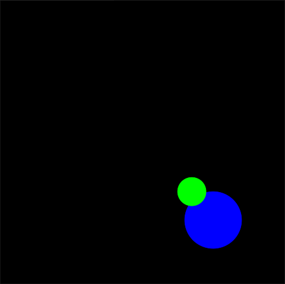

<!-- License

Copyright 2022-2023 Neuromechatronics Lab, Carnegie Mellon University (a.whit)

Contributors:
  a. whit. (nml@whit.contact)

This Source Code Form is subject to the terms of the Mozilla Public
License, v. 2.0. If a copy of the MPL was not distributed with this
file, You can obtain one at https://mozilla.org/MPL/2.0/.
-->


## Command line example

This example is intended to illustrate basic usage of the GUI via the 
[ROS2 command line tools]. This is most useful for quickly becoming acquainted 
with this package. Further information about the command line tools is 
provided with the [ros2cli] pacakge.

### Setup

This example requires interaction with ROS2 via two separate command line 
interfaces (e.g., two BASH shells or two MS-DOS-style prompts). These will be 
referred to as _command line A_ and _command line B_.

ROS2 commands can only be run from within [configured ROS2 environment]s. 
Configure _command line A_ and _command line B_ by 
[sourcing the ROS2 environment][source the ROS2 environment] for each.

In what follows, commands intended for _command line A_ will be preceded with a 
`A>` prompt. Those intended for _command line B_ will be preceded with a `B>` 
prompt.

### Start the GUI

To set up the workspace, [source the workspace overlay] in _command line A_.

Linux:

```bash
A> cd path/to/workspace
A> source install/local_setup.bash
```

Windows:

```msdos
A> cd path\to\workspace
A> call install\local_setup.bat
```

Once the environment is set up, start the GUI node using the `run` 
sub-command / verb. A GUI canvas should appear immediately.[^canvas_color]

```bash
ros2 run ros_tkinter_spheres_environment_gui main
```

[^canvas_color]: The canvas background color should default to black. However, 
                 the color can be set explicitly, via a ROS2 parameter:
                 `ros2 run ros_tkinter_spheres_environment_gui main --ros-args -p canvas.color:=black`

The `run` command is blocking; no further commands can be entered via 
_command line A_.

### Initialize an object in the GUI environment

A number of [ROS2 topics] have been created. Listing the active topics shows 
that an `initialize` topic is now available.

```bash
B> ros2 topic list
```

Create a circle on the canvas GUI by publishing a key (i.e., a unique string 
identifier) to this topic. This key serves as the name or label that will be 
used to reference the object. Here, the target sphere[^sphere] will be referred 
to using the "target" key.

[^sphere]: The object is often referred to as a _sphere_, in this context, even 
           though it appears on the GUI canvas as a circle. This is because the 
           `sphere_environment` framework assumes that the virtual environment 
           is 3-dimensional, even though the visual representation is 2D.

```bash
ros2 topic pub --once /initialize example_interfaces/msg/String "{data: target}"
```

Request a list of active topics with the `ros2 topic list` command. The list 
should now show the addition of the `position`, `radius`, and `color` topics 
associated with the `target` object.

```bash
/destroy
/initialize
/parameter_events
/rosout
/target/position
/target/radius
/target/color
```

To make the new object visible against the black background,[^sphere_color] 
change the color of the object to blue by publishing to the `color` topic.

[^sphere_color]: All circles initialized on the canvas will be colored black 
                 by default.
                 
```bash
B> ros2 topic pub --once target/color std_msgs/msg/ColorRGBA \
   "{r: 0.0, g: 0.0, b: 1.0, a: 1.0}"
```

The GUI should now appear as in Figure 1, with the blue, circular target object 
covering most of the canvas.


Re-size and re-position the target by publishing messages to the `radius` and 
`position` topics. This causes the canvas to appear as in Figure 2.


```bash
B> ros2 topic pub --once /target/radius example_interfaces/msg/Float64 "{data: 0.20}"
B> ros2 topic pub --once /target/position geometry_msgs/msg/Point "{x: 0.50, y: -0.55, z: 1.00}"
```


Add a second sphere, and similarly re-color, re-size and re-position it. This 
causes the canvas to appear as in Figure 3.

```bash
B> ros2 topic pub --once /initialize example_interfaces/msg/String "{data: cursor}"
B> ros2 topic pub --once /cursor/color std_msgs/msg/ColorRGBA \
   "{r: 0.0, g: 1.0, b: 0.0, a: 1.0}"
B> ros2 topic pub --once /cursor/radius example_interfaces/msg/Float64 "{data: 0.10}"
B> ros2 topic pub --once /cursor/position geometry_msgs/msg/Point "{x: -0.25, y: 0.25, z: 0.00}"
```


Move the cursor sphere to overlap with the target sphere. This causes the 
canvas to appear as in Figure 4.

```bash
B> ros2 topic pub --once /cursor/position geometry_msgs/msg/Point "{x: 0.35, y: -0.35, z: 0.00}"
```



Destroy the target sphere and re-size the cursor sphere.
<!-- 
[^destroy_bug]

[^destroy_bug]: At present, the `destroy` call does not immediately update the 
                visual appearance of the canvas. This is a bug.

This causes the canvas to appear as in Figure 5.
-->

```bash
B> ros2 topic pub --once /destroy example_interfaces/msg/String "{data: target}"
B> ros2 topic pub --once /cursor/radius example_interfaces/msg/Float64 "{data: 0.05}"
```


Clean up by terminating the _command line B_ environment. Shut-down the ROS2 
node and destroy the GUI by pressing `Ctrl-C` at _command line A_.

```bash
B> exit
A> <Ctrl-C>
A> exit
```

<!---------------------------------------------------------------------
   References
---------------------------------------------------------------------->

[neuromechatronics]: https://www.meche.engineering.cmu.edu/faculty/neuromechatronics-lab.html

[ROS2 graph]: https://docs.ros.org/en/humble/Tutorials/Beginner-CLI-Tools/Understanding-ROS2-Nodes/Understanding-ROS2-Nodes.html#background

[ros_spheres_environment]: https://github.com/ricmua/ros_spheres_environment.git

[tkinter_spheres_environment_gui]: https://github.com/ricmua/tkinter_spheres_environment_gui

[z-order]: https://en.wikipedia.org/wiki/Z-order

[RGBA]: https://en.wikipedia.org/wiki/RGBA_color_model

[source the workspace overlay]: https://docs.ros.org/en/humble/Tutorials/Beginner-Client-Libraries/Creating-A-Workspace/Creating-A-Workspace.html#source-the-overlay

[source the ROS2 environment]: https://docs.ros.org/en/humble/Tutorials/Beginner-Client-Libraries/Creating-A-Workspace/Creating-A-Workspace.html#source-ros-2-environment

[ROS2 command line tools]: https://docs.ros.org/en/humble/Concepts/About-Command-Line-Tools.html

[configured ROS2 environment]: https://docs.ros.org/en/humble/Tutorials/Configuring-ROS2-Environment.html

[ROS2 topics]: https://docs.ros.org/en/humble/Tutorials/Beginner-CLI-Tools/Understanding-ROS2-Topics/Understanding-ROS2-Topics.html#background

[ROS2 workspace]: https://docs.ros.org/en/humble/Tutorials/Beginner-Client-Libraries/Creating-A-Workspace/Creating-A-Workspace.html

[ros2cli]: https://github.com/ros2/ros2cli#ros2cli


